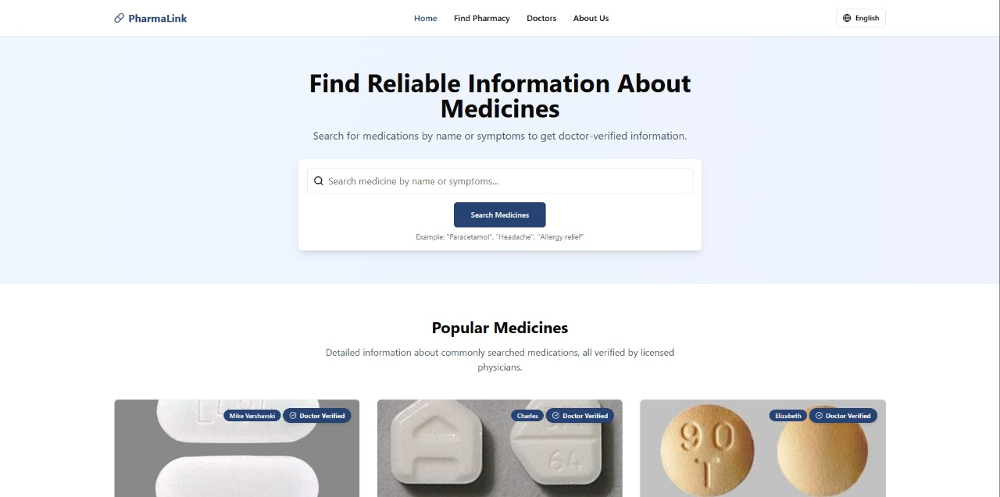
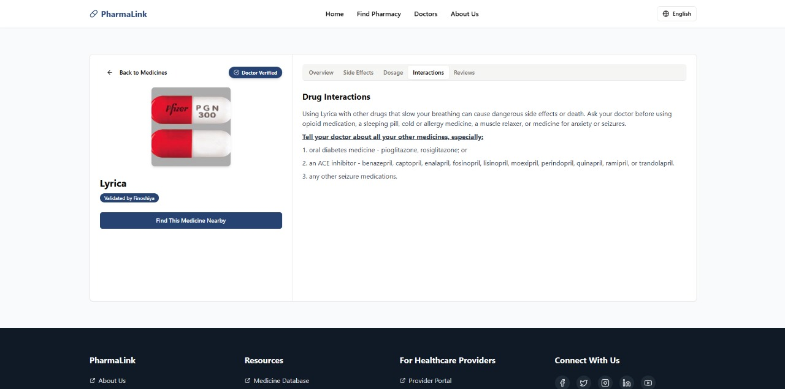
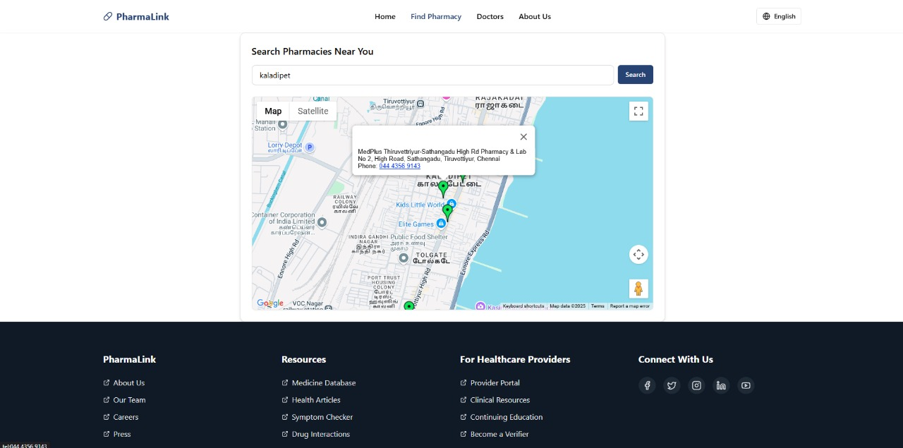

# 💊 PharmaLink

PharmaLink is a doctor-verified medicine information platform that bridges the gap between users, doctors, and pharmacies. It allows users to:

- Search medicines by **name** or **symptoms**
- Filter medicines by **symptoms**
- View verified information on dosage, side effects, interactions, etc.
- Locate **nearby pharmacies** using **Google Maps API**

---

## 📁 Project Structure

```
PharmaLink/
├── frontend/         # React + Tailwind + TypeScript frontend
├── backend/          # Django backend (Google Maps API integration)
└── pharmalink-cms/   # Strapi CMS (doctor-verified medicine data)
```

---

## 🚀 Setup Instructions

### 1. 📦 Frontend (`frontend/`)

```bash
cd frontend
npm install
npm run dev
```

> Runs on [http://localhost:5173](http://localhost:5000)

🧠 **Important**:
- In `index.html`, you’ll find:
```
src="https://maps.googleapis.com/maps/api/js?key=Your_google_maps_API_key_here"
```
Replace this with your **actual Google Maps API key** to enable map features.

---

### 2. 🐍 Backend API (`backend/`)

```bash
cd backend
python -m venv venv
venv\Scripts\activate    
pip install -r requirements.txt
python manage.py runserver
```

> Runs on [http://localhost:8000](http://localhost:8000)

🧠 **Important**:
- In `views.py`, you’ll find:
```python
GOOGLE_PLACES_API_KEY = "Your API Key Here"
```
Replace this with your **actual Google Maps API key** to enable map features.

---

### 3. 🧠 CMS (Strapi - `pharmalink-cms/`)

```bash
cd pharmalink-cms
npm install
npm run develop
```

> Runs on [http://localhost:1337](http://localhost:1337)

✅ This handles the medicine entries, doctor login (custom role), and editing access.

---

## 🧪 Features

- 🌐 Search by name/symptoms
- 🧠 Doctor-verified medicine cards
- 📍 Google Maps-based pharmacy locator
- 💡 Filters & sort-by-name (A → Z, Z → A)
- 🧰 Admin CMS via Strapi
- 🔒 Separate Doctor Role (with controlled permissions)

---

## 📸 Screenshots

### Homepage



### Medicine Details



### Pharmacy Locator



### Strapi CMS


---

## 🔑 API Keys to Replace

| File                         | Replace With                                          |
|------------------------------|-------------------------------------------------------|
| `backend/views.py`           | Replace `GOOGLE_PLACES_API_KEY = "Your API Key Here"` |
| `frontend/client/index.html` | Replace `GOOGLE_PLACES_API_KEY = "Your API Key Here"` |

---

## 🧑‍💻 Team

Built by [Shailesh Narayan](https://github.com/ShaileshNarayan) and team [Vishwa](https://github.com/Vishwa-1514), [Hari Bhaskar](https://github.com/Haribhaskar16) as part of an academic mini-project.

---

## License

This project is released under the [MIT License](LICENSE).

Feel free to use, modify, or share it — no attribution required, but always appreciated!

